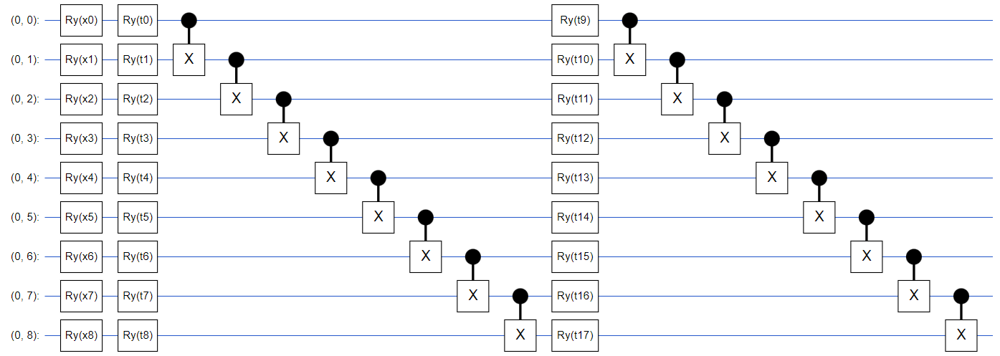
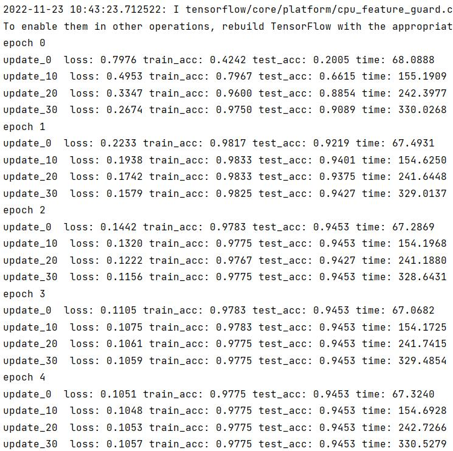

# Variational quantum classifier (VQC)
This repository includes code for variational quantum classifier.

---

## Requirements
```
tensorflow==2.8.0
tensorflow-quantum==0.6.1
```

## Ansatz
Using 9 qubuts, 2 layer hardware efficient Ansatz.



## Baseline results achieved by Hardware-efficient ansatz
* Quantum Classfier
  ```shell
  cd variational_quantum_classifier
  python main.py    # train VQC

  ```
---
## Experiment results
* Quantum Machine Learning




(a) When classifying digit 3 and 6, the train accuracy can reach 97.75%, test accuracy reach 94.53%.

---

