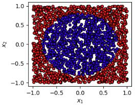
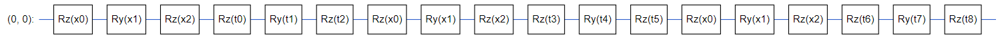

# Single Qubit Classifier (SQC)
This repository includes code for variational quantum classifier.

---

## Requirements
```
tensorflow==2.8.0
tensorflow-quantum==0.6.1
```

## Dataset
2-dimension circle data


## Ansatz
Using 1 qubuts, 3 layer re-upload Ansatz.



## Baseline results achieved by Hardware-efficient ansatz
* Quantum Classfier
  ```shell
  cd variational_quantum_classifier/single_qubit_classifier
  python main.py    # train
  ```
---
## Experiment results
* Quantum Machine Learning
```shell
epoch 0
update_0  loss: 0.2884 train_acc: 0.5800 test_acc: 0.6030 time: 29.9158
epoch 1
update_0  loss: 0.2106 train_acc: 0.6200 test_acc: 0.6680 time: 29.3804
epoch 2
update_0  loss: 0.1960 train_acc: 0.6800 test_acc: 0.6860 time: 29.5147
epoch 3
update_0  loss: 0.1530 train_acc: 0.7900 test_acc: 0.8175 time: 28.9935
epoch 4
update_0  loss: 0.1729 train_acc: 0.6900 test_acc: 0.7385 time: 29.1243
epoch 5
update_0  loss: 0.1346 train_acc: 0.7950 test_acc: 0.8170 time: 29.3601
epoch 6
update_0  loss: 0.1126 train_acc: 0.8600 test_acc: 0.8890 time: 29.4170
epoch 7
update_0  loss: 0.1230 train_acc: 0.8350 test_acc: 0.8660 time: 29.5351
epoch 8
update_0  loss: 0.1193 train_acc: 0.8300 test_acc: 0.8725 time: 29.5433
epoch 9
update_0  loss: 0.1171 train_acc: 0.8350 test_acc: 0.8770 time: 29.5426
epoch 10
update_0  loss: 0.1189 train_acc: 0.8350 test_acc: 0.8715 time: 29.9595
epoch 11
update_0  loss: 0.1178 train_acc: 0.8450 test_acc: 0.8710 time: 29.2391
epoch 12
update_0  loss: 0.1177 train_acc: 0.8450 test_acc: 0.8720 time: 29.7639
epoch 13
update_0  loss: 0.1186 train_acc: 0.8350 test_acc: 0.8720 time: 29.6297
epoch 14
update_0  loss: 0.1169 train_acc: 0.8450 test_acc: 0.8780 time: 29.4169
epoch 15
update_0  loss: 0.1177 train_acc: 0.8450 test_acc: 0.8730 time: 29.2286
epoch 16
update_0  loss: 0.1177 train_acc: 0.8450 test_acc: 0.8705 time: 29.5359
epoch 17
update_0  loss: 0.1175 train_acc: 0.8450 test_acc: 0.8735 time: 29.5053
epoch 18
update_0  loss: 0.1175 train_acc: 0.8450 test_acc: 0.8750 time: 29.7849
epoch 19
update_0  loss: 0.1175 train_acc: 0.8450 test_acc: 0.8740 time: 29.4780
```

(a) When classifying 2-dimension data, the train accuracy can reach 84.50%, test accuracy reach 87.40%.

---

